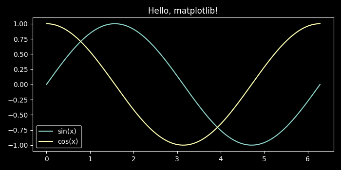

# Getting started with modern scientific Python

We've embarked. It's time to run some code!

```python title="hello_matplotlib.py"
--8<-- "code/hello_matplotlib.py"
```

We run it with python and...
```console
> python hello_matplotlib.py
Traceback (most recent call last):
  File "/home/lotus/Repositories/py-onramp/code/hello_matplotlib.py", line 2, in <module>
    import matplotlib.pyplot as plt
ModuleNotFoundError: No module named 'matplotlib'
```

Well. Anticlimactic.

One of the greatest stengths of the Python of today is vast ecosystem of
existing code that you can rely on. To get started with python, we first must
learn how to manage those dependencies, in this case `matplotlib` and `numpy`!

This page is the practical starting point for a new scientific Python project.
The goal is to get a working local environment using `uv`, install the
dependencies you need, and understand what the project-local virtual environment
is doing for you.

## Install `uv`

[`uv`](https://docs.astral.sh/uv/) is a fast Python package and project manager.
It can install Python itself, create a project, resolve dependencies, and
manage the virtual environment in one workflow.
Historically, there have many tools for this task but, today, I highly recommend
`uv`.

Follow the official installation instructions for your platform:

!!! note

    [Install `uv` here: https://docs.astral.sh/uv/getting-started/installation/](https://docs.astral.sh/uv/getting-started/installation/)

After installation, confirm that it is available:

```console
$ uv --version
```

If you do not already have a suitable Python installed, `uv` can install one:

```console
$ uv python install
```

That gives you a managed Python interpreter without needing Anaconda or a
system-wide package manager.

## Create a new project

The recommended starting point is a project directory with a `pyproject.toml`
file. That gives `uv` a place to record metadata and dependencies.

To create a simple script-oriented project:

```console
$ uv init my-project
$ cd my-project
```

This creates a small starter layout, including `pyproject.toml`, a `README.md`,
and a starter Python file.

If you already made the directory, initialize it in place:

```console
$ mkdir my-project
$ cd my-project
$ uv init
```

If you know you are building a reusable library or package, `uv` also supports
library-oriented initialization. We defer the details of package layout and
build configuration to [Packaging](packaging.md), since that is where concepts
like module structure, installable projects, and publishing belong.

## Add dependencies

Once the project exists, add the packages you need with `uv add`:

```console
$ uv add numpy matplotlib
```

This updates your `pyproject.toml`, refreshes the lockfile, and syncs the
project environment.

If you clone an existing project that already has a `pyproject.toml` and
`uv.lock`, install everything recorded there with:

```console
$ uv sync
```

That is the usual command for "make my environment match this project".

## Run code in the project

Use `uv run` to execute code inside the project's environment:

```console
$ uv run main.py
```

You can also run tools this way. For example, if you installed `pytest` (which
we will discuss later), you could run the corresponding CLI tool as

```console
$ uv run pytest
```

This matters because it guarantees that the command uses the project's managed
Python and dependencies, not whatever happens to be installed globally on your
machine.

## What is a virtual environment?

A virtual environment, usually shortened to *venv*, is a directory containing a
Python interpreter plus a private set of installed packages for one project.

With `uv`, the project environment usually lives in a local `.venv/` directory
next to `pyproject.toml`. Keeping the environment inside the project has two
important benefits:

- Dependencies for one project do not interfere with another project.
- Editors and tools can usually detect `.venv` automatically.

In practice, you can think of a venv as "this project's Python". When you use
`uv add`, `uv sync`, or `uv run`, `uv` manages that environment for you.

You do not need to understand every implementation detail before you begin.
What matters early on is the workflow:

1. Create a project with `uv init`.
2. Add dependencies with `uv add`.
3. Run code and tools with `uv run`.
4. Recreate the environment later with `uv sync`.

## A minimal first session

Here is the shortest useful workflow for a new project:

```console
$ uv python install
$ uv init my-project
$ cd my-project
$ uv add dep1 dep2 
$ uv run main.py
```

For more on structuring that project as an installable package or library, move
on to [Packaging](packaging.md).

As for our original example: Running

```console
$ uv init my-project
$ cd my-project
$ uv add numpy matplotlib
$ uv run hello_matplotlib.py # Having obtained this file somehow
```

{ width="60%" }
