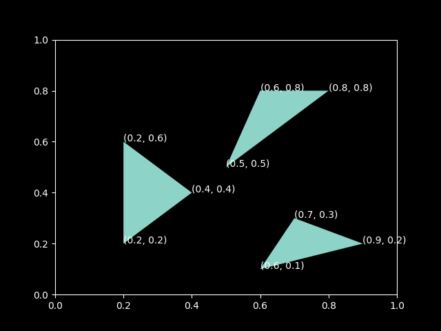

# Organizing code for a Python project

A well structured project is easy to navigate and make changes and
improvements to. It is also more likely to be used by other people, and
that includes *you* a few weeks from now.

## Organization basics

We want to write a Python program that draws triangles:

{ width="60%" }

We use the
[Polygon](https://matplotlib.org/gallery/api/patch_collection.html)
class from [matplotlib](https://matplotlib.org/) and write a script
called `draw_triangles.py` to do this:

```python title="draw_triangles.py"
--8<-- "code/draw_triangles-v1.py"
```

Do you think this is a good way to organize the code? What do you think
could be improved in the script `draw_triangles.py`?

### Functions

Functions facilitate code reuse. Whenever you see yourself typing the
same code twice in the same program or project, it is a clear indication
that the code belongs in a function.

A good function:

- has a descriptive name. `draw_triangle` is a better name than `plot`.
- is small, no more than a couple of dozen lines, and does **one**
  thing. If a function is doing too much, then it should probably be
  broken into smaller functions.
- can be easily tested, more on this soon.
- is well documented, more on this later.

In the script `draw_triangles.py` above, it would be a good idea to
define a function called `draw_triangle` that draws a single triangle
and re-use this function every time we need to draw a triangle:

```python title="draw_triangles.py"
--8<-- "code/draw_triangles-v2.py"
```

### Python scripts and modules

A *module* is a file containing a collection of Python definitions and
statements, typically named with a `.py` suffix.

A *script* is a module that is intended to be run by the Python
interpreter. For example, the script `draw_triangles.py` can be run from
the command line using the command:

```console
$ python draw_triangles.py
```

If you are using an integrated development environment like Spyder or
[PyCharm](https://www.jetbrains.com/pycharm/), then the script can be
run by opening it in the IDE and clicking on the "Run" button.

Modules, or specific functions from a module, can be imported using the
`import` statement:

```python
import draw_triangles
from draw_triangles import draw_triangle
```

When a module is imported, all the statements in the module are executed
by the Python interpreter. This happens only the first time the module
is imported.

It is sometimes useful to have both importable functions as well as
executable statements in a single module. When importing functions from
this module, it is possible to avoid running other code by placing it
under `if __name__ == "__main__"`:

```python title="draw_triangles.py"
--8<-- "code/draw_triangles-v3.py"
```

When another module imports the module `draw_triangles` above, the code
under `if __name__ == "__main__"` is **not** executed.

## How to structure a Python project?

Let us now imagine we had a lot more code, for example a *collection* of
functions for:

- plotting shapes like `draw_triangle`
- calculating areas
- geometric transformations

What are the different ways to organize code for a Python project that
is more than a handful of lines long?

### A single module

```text
geometry
└── draw_triangles.py
```

One way to organize your code is to put all of it in a single `.py` file
like `draw_triangles.py` above.

### Multiple modules

For a small number of functions the approach above is fine, and even
recommended, but as the size or scope of the project grows, it may be
necessary to divide code into different modules, each containing related
data and functionality.

```text
geometry
├── draw_triangles.py
└── graphics.py
```

```python title="graphics.py"
--8<-- "code/graphics.py"
```

Typically, the top-level executable code is put in a separate script
which imports functions and data from other modules:

```python title="draw_triangles.py"
import graphics

graphics.draw_triangle([
    (0.2, 0.2),
    (0.2, 0.6),
    (0.4, 0.4),
])

graphics.draw_triangle([
    (0.6, 0.8),
    (0.8, 0.8),
    (0.5, 0.5),
])

graphics.draw_triangle([
    (0.6, 0.1),
    (0.7, 0.3),
    (0.9, 0.2),
])
```

### Packages

A Python **package** is a directory containing a file called
`__init__.py`, which can be empty. Packages can contain modules as well
as other packages, sometimes referred to as *sub-packages*.

For example, `geometry` below is a package containing various modules:

```text
draw_triangles.py
geometry
├── graphics.py
└── __init__.py
```

A module from the package can be imported using dot notation:

```python
import geometry.graphics
geometry.graphics.draw_triangle(args)
```

It is also possible to import a specific function from the module:

```python
from geometry.graphics import draw_triangle
draw_triangle(args)
```

Packages can themselves be imported, which really just imports the
`__init__.py` module.

```python
import geometry
```

If `__init__.py` is empty, there is "nothing" in the imported
`geometry` package, and the following line gives an error:

```python
geometry.graphics.draw_triangle(args)
```

```python
AttributeError: module 'geometry' has no attribute 'graphics'
```

## Importing from anywhere

### `sys.path`

To improve reusability, you typically want to be able to `import` your
modules and packages from anywhere, that is, from any directory on your
computer.

One way to do this is to use `sys.path`:

```python
import sys
sys.path.append("/path/to/geometry")

import graphics
```

`sys.path` is a list of directories that Python looks for modules and
packages in when you `import` them.

### Installable projects

A better way is to turn your code into a proper project with
[`uv`](https://docs.astral.sh/uv/). For a reusable library, `uv` can
create the basic layout for you:

```console
$ uv init --lib geometry
$ cd geometry
```

This creates a `pyproject.toml` describing the project, a package
directory for your importable code, and a local project environment that
`uv` can manage for you. A small library project might then look like
this:

```text
pyproject.toml
README.md
geometry
├── graphics.py
└── __init__.py
```

A minimal `pyproject.toml` can include the following:

```toml title="pyproject.toml"
[project]
name = "geometry"
version = "0.1.0"
description = "Geometry utilities for drawing and transforming shapes"
readme = "README.md"
requires-python = ">=3.12"
```

If the project has dependencies, add them with `uv add`:

```console
$ uv add matplotlib
```

This updates `pyproject.toml`, refreshes the lockfile, and syncs the
project environment.

To create or refresh the environment for the project, run:

```console
$ uv sync
```

Once the project environment exists, you can run Python or other tools
inside it with `uv run`:

```console
$ uv run python
```

This starts Python with your package available for import, without
manually editing `sys.path`.

For example:

```python
import geometry.graphics
geometry.graphics.draw_triangle(args)
```

During development, `uv` works directly with the project in your current
checkout, so changes to your package are immediately visible the next
time you use `uv run`.
